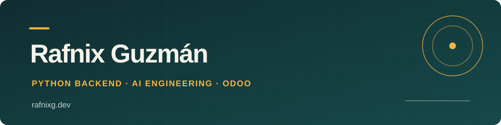

# Hola, soy Rafnix 👋 / Hi, I'm Rafnix

**ES** · Soy desarrollador Python especializado en backend, Odoo e IA aplicada. Llevo más de 15 años construyendo sistemas web e integraciones para empresas. Me interesa convertir problemas complejos en herramientas útiles y compartir lo que aprendo en el camino.

**EN** · I'm a Python developer focused on backend systems, Odoo, and applied AI. For over 15 years, I've built web systems and integrations for businesses. I enjoy turning complex problems into useful tools and sharing what I learn along the way.

[Sitio web / Website](https://rafnixg.dev) · [Proyectos / Projects](https://rafnixg.dev/projects.html) · [CV / Résumé](https://resume.rafnixg.dev) · [LinkedIn](https://www.linkedin.com/in/rafnixg/)

## En qué trabajo / What I work on

**Backend y ERP / Backend & ERP** · APIs, Odoo e integraciones con Python, FastAPI, Django y PostgreSQL. / APIs, Odoo and integrations built with Python, FastAPI, Django and PostgreSQL.

**IA aplicada / Applied AI** · Agentes, flujos RAG y herramientas con LLM. / Agents, RAG pipelines and LLM tools.

**Infraestructura / Infrastructure** · Docker, Proxmox, Linux y automatización CI/CD. / Docker, Proxmox, Linux and CI/CD automation.

## Proyectos destacados / Selected work

- **[Femtobot](https://github.com/rafnixg/femtobot)** · Una demostración educativa de agentes conversacionales en Python. / An educational Python conversational agent demo.
- **[SismosVE](https://github.com/rafnixg/sismosve)** · Monitoreo de sismos en Venezuela con FastAPI y un mapa interactivo. / Venezuela earthquake monitoring with FastAPI and an interactive map.
- **[Own WSGI](https://github.com/rafnixg/own_wsgi)** · Un servidor WSGI construido desde cero para explorar cómo funciona la web por dentro. / A WSGI server built from scratch to explore web internals.

[Explorar más proyectos / Explore more projects →](https://rafnixg.dev/projects.html)

## Artículos recientes / Recent writing

- [Nanobot: Arquitectura y Funcionamiento del Agente IA Ultra-ligero](https://blog.rafnixg.dev/nanobot-arquitectura-y-funcionamiento-del-agente-ia-ultra-ligero)
- [⚙️ Como automatizar tu librería en PyPI con GitHub Actions](https://blog.rafnixg.dev/como-automatizar-tu-libreria-en-pypi-con-github-actions)
- [🏗️ Cómo publicar tu propia librería de Python: Guía paso a paso](https://blog.rafnixg.dev/como-publicar-tu-propia-libreria-de-python-guia-paso-a-paso)
- [Shell de Odoo: Domina Operaciones Avanzadas, Integración de Librerías y Automatización de Tareas](https://blog.rafnixg.dev/shell-de-odoo-domina-operaciones-avanzadas-integracion-de-librerias-y-automatizacion-de-tareas)
- [Explorando Odoo a fondo: Cómo trabajar con la shell de la CLI y configurar IPython como REPL](https://blog.rafnixg.dev/explorando-odoo-a-fondo-como-trabajar-con-la-shell-de-la-cli-y-configurar-ipython-como-repl)

## Hablemos / Let's connect

[Blog](https://blog.rafnixg.dev) · [Todos mis enlaces / All my links](https://links.rafnixg.dev) · [LinkedIn](https://www.linkedin.com/in/rafnixg/)
